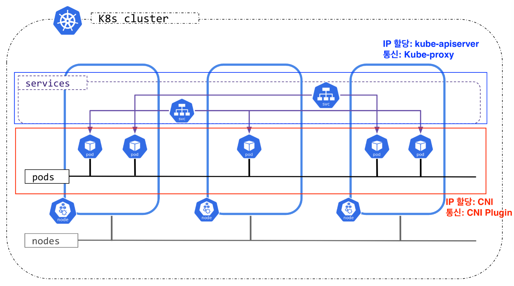
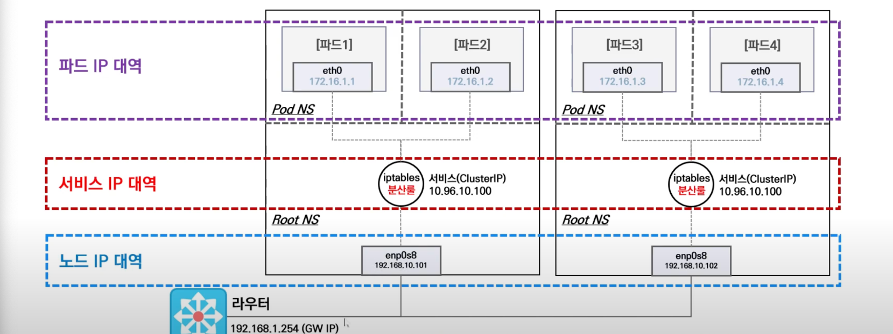
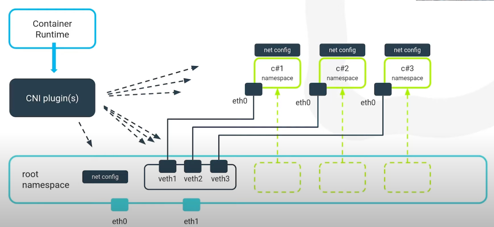
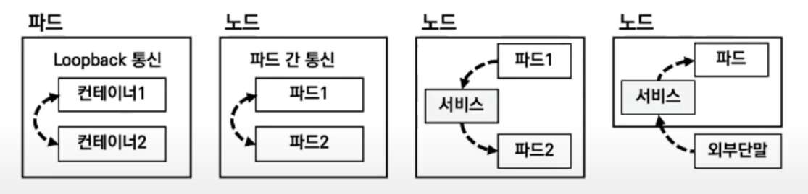

# Kubernetes Networking??

## 쿠버네티스 운영자가 쿠버네티스 네트워킹에 대한 생각

쿠버네티스 네트워크 구성은 간단하고 별도의 지식 없이 설치해도 잘 동작한다. (`kubectl apply -f` )
**본인이 생각하는 세가지 이유:**

* 훌륭한 네트워크 구조 설계
* 컨테이너 네트워크 인터페이스 도입
* 다양한 3rd Plugins

## **1. 훌륭한 네트워크 구조 설계**: [Cluster Networking](https://kubernetes.io/docs/concepts/cluster-administration/networking/)

**구성 예시:** 

## 2. 컨테이너 네트워크 인터페이스 (Container Network Interface, CNI)

## 3. Network를 구성하는 다양한 [3rd party plugins](https://www.cni.dev/docs/#3rd-party-plugins)

* [Project Calico](https://github.com/projectcalico/calico-cni) - a layer 3 virtual network
* [Cilium](https://github.com/cilium/cilium) - BPF \& XDP for containers
* [Multus](https://github.com/k8snetworkplumbingwg/multus-cni) - a Multi plugin
* [Amazon ECS CNI Plugins](https://github.com/aws/amazon-ecs-cni-plugins) - a collection of CNI Plugins to configure containers with Amazon EC2 elastic network interfaces (ENIs)
* [ovn-kubernetes](https://github.com/openvswitch/ovn-kubernetes) - a container network plugin built on Open vSwitch (OVS) and Open Virtual Networking (OVN) with support for both Linux and Windows

## 쿠버네티스 네트워크의 장/단점 (추상화..)

1. 컨테이너 네트워크 인터페이스를 설치하면 잘 동작한다.
    * 하지만, 네트워크 장애나 문제 발생 시, 어떻게 확인하고 대응할지 모르겠다.
2. 서비스 Service 와 인그레스 Ingress, 서비스 메시 Service Mesh 설정 후 잘 동작한다.
    * 하지만, 어떻게 외부/내부에서 노드와 파드를 통해서 통신되는지 흐름을 알기 어렵다.
3. 사내에 있는 네트워크 팀과 특별히 업무 협조를 하지 않아도 잘 동작한다. (서버에 IP 할당 후 통신만 되면 끝)
    * 하지만, 어떻게 네트워크가 구성되어 이런 일이 가능한지 알기 어렵다 (리눅스 네트워크, Overlay Network, 인프라 네트워크 지식등에 대한 이해가 필요)

## 요약:

기본적으로 쿠버네티스 네트워크는 알아서 잘 깔끔하게 동작한다.
하지만 장애 발생 시 대응과 분석이 어렵고 트래픽 분석, 성능 최적화 등의 구성의 변경을 하고자 할 때 추상화 이면에 있는 부분들을 이해해야 한다.

# 쿠버네티스 클러스터 네트워킹

쿠버네티스 클러스터에 해결해야 할 네 가지 주요 네트워킹 문제:

1. **파드 내에 구성된 컨테이너 간 통신**: 같은 네트워크 네임스페이스 내에 격리하여 localhost 통신 -> **CNI의 역할**
2. **파드 간 통신**: 파드 간 독립된 IP를 할당하고, 파드 간 통신을 위한 라우팅 설정 -> **CNI의 역할**
    * 같은 노드 내 파드 통신
    * 다른 노드 간 파드 통신
3. **파드에서 서비스로의 통신**: 클러스터 내부에서 서비스 (Service)를 통한 통신 -> kube-proxy (혹은 cilium)
4. **외부에서 서비스로의 통신**: 클러스터 외부에서 서비스 (Service)를 통한 통신

## 컨테이너 네트워크 인터페이스 CNI

CNI:  컨테이너 네트워킹을 설정하고 관리하기 위한 표준 인터페이스, 해당 인터페이스를 통해 컨테이너 네트워크 환경을 구성

* containerd를 통해 파드를 생성할 때 네트워크 관련 설정을 CNI 인터페이스를 통해 호출
* CNI 플러그인은 기본적으로 파드 생성 시 IP를 할당하고, 파드 IP 대역간 통신(노드 내부/외부)을 가능하게 하는 역할
* 실제 동작을 구현하는 다양한 **CNI 플러그인** 이 존재
    * Flannel, Calico, Cilium, AWS VPC CNI, ovn-kubernetes, kube-ovn, multus ....
    * 어떤 방식으로 POD간의 통신이 가능하게 하는지는 각 플러그인마다 구현방식이 상이함.
* CNI 플러그인을 통해 IP 할당을 관리 (IP Address Management, IPAM) 하고, 파드 간 통신을 위한 설정을 처리
    * **각 CNI 플러그인 마다 파드 간의 통신 구현이 상이 함**
        * Calico: L3 라우팅
        * ovn-kubernetes: Open vSwitch
        * Cilium: eBPF

## CNI Plugin 선택

CNI 와 Overlay Networking에 대한 고찰

1. **CNI 제공자 선택**:
    * 쿠버네티스는 기본적으로 파드 네트워킹을 제공하지 않음.
    * 다양한 CNI 제공자 중 선택 필요. 혹은 자체 개발(AWS, Azure)
2. **네트워크 구현 방식**:
    * 상황에 맞는 다양한 네트워크 구현 방식을 고려할 수 있음.

**CNI 제공자**

* 다양한 CNI 제공자:
    * 예: Calico, Flannel, Weave, Cilium, ovn-kubernetes 등.
* 각 CNI 제공자는 고유한 기능과 특성을 가지고 있음.
    * 네트워크 구성하는 방법이 CNI 마다 다름

**네트워크 구현 방식**

1. **오버레이 네트워크**:
    * **VXLAN**: 가장 많이 사용되는 오버레이 네트워크 방식 중 하나로, 네트워크 패킷을 가상 네트워크 상에서 캡슐화하여 전송.
    * **GRE**: 또 다른 오버레이 네트워크 방식으로, 단순하고 효율적인 캡슐화 방식 제공
    * **IPIP**: IP-in-IP 캡슐화를 사용하여 네트워크 패킷을 전송, 간단한 설정과 낮은 오버헤드가 특징..
2. **라우팅 기반 네트워크**:
    * **Calico**: BGP(Border Gateway Protocol)를 사용하여 라우팅 기반 네트워크를 구현, 고성능과 낮은 오버헤드를 제공.
    * **Cilium**: eBPF(extended Berkeley Packet Filter)를 사용하여 네트워크 트래픽을 필터링하고 라우팅, 높은 유연성과 성능을 제공.
3. **브리지 네트워크**:
    * **Flannel**: 기본적으로 오버레이 네트워크를 사용하지만, Host-GW(호스트 게이트웨이) 모드를 통해 브리지 네트워크 방식으로도 구현 가능.

클러스터 구성 시, CNI 제공자와 네트워크 구현 방식을 정하는 것이 매우 중요함.

# 클라우드 제공 업체의 default CNI Plugin

| 제공 업체 | 관리형 | 상품명 | CNI | CNI 호환여부 | 비고 |
| ----- | --- | --- | --- | -------- | --- |
| NHN Cloud | O | NKS | Calico | X |  |
| Naver Cloud | O | NCloud | Cilium | X |  |
| AWS | O | EKS | Amazon VPC CNI | O | calico, cilium 별도 지원을 받거나 사내 전문가가 있을 경우 변경을 권장 |
| Google Cloud | O | GKE(V2) | Cilium based | ? | cilium 기반의 자사 CNI |
| Microsoft Azure | O | AKS | Azure CNI | ? |  |
| Redhat Openshift | ? | ? | ovn-kubernetes | ? |  |
