# Calico CNI

* POD(파드) 의 IP를 할당하고(calico/cni), POD간 통신을 가능(calico/node)하게 해주는 쿠버네티스 네트워크 CNI 플러그인 중 하나이다.
* 파드간 네트워킹을 가능하게 하는 여러 방법이 있다.
* Calico는 vRouter(가상 라우터)를 구현하여 라우팅 정보를 기반으로 파드 간 통신을 지원한다.
    * 비교: OpenStack Neutron 은 VM간의 통신을 Open vSwitch의 OpenFlow tables 로 구성
* Calico 구성 요소는 다음과 같다:
    1. calico/cni: pod 생성 시 구성된 Network Namespace에 veth 연결, pod IP 할당(IPAM), routing 설정등의 작업을 한다.
       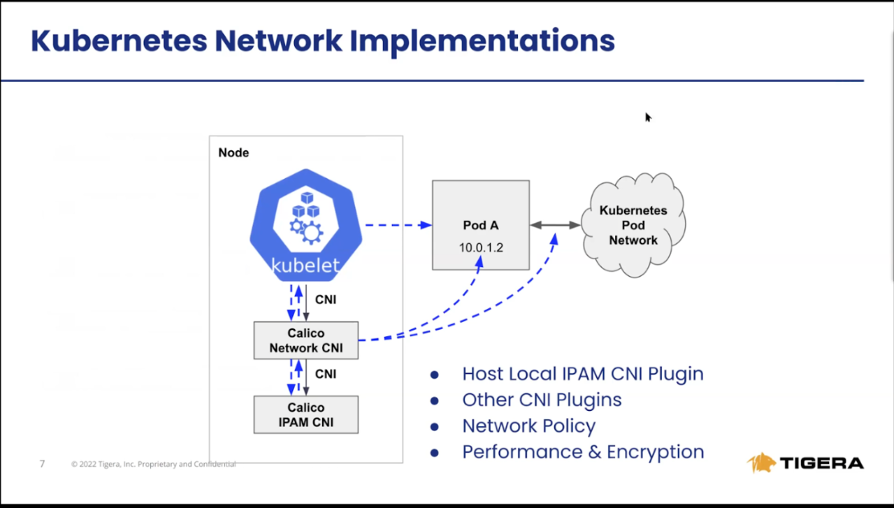
    2. calico/node agent: felix, bird, and conf 로 구성, 파드 간 통신을 위한 라우팅 설정
       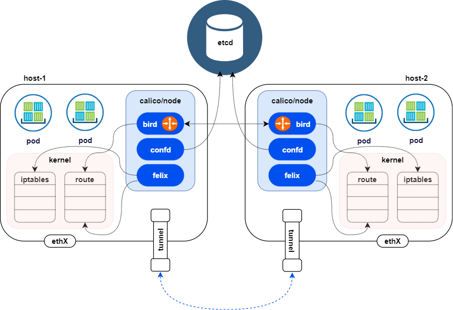
    3. calico/kube-controller: NetworkPolicy를 확인하여 calico node에 설정 전달

Calico에서는 3가지 라우팅 모드를 지원한다.

* **IP-in-IP**: default; encapsulated (BGP OK)
* **Direct/NoEncapMode**: unencapsulated (Preferred)
* **VXLAN**: encapsulated (No BGP) <- **NKS에서 사용되는 모드**

<각 라우팅 모드의 동작 방식>
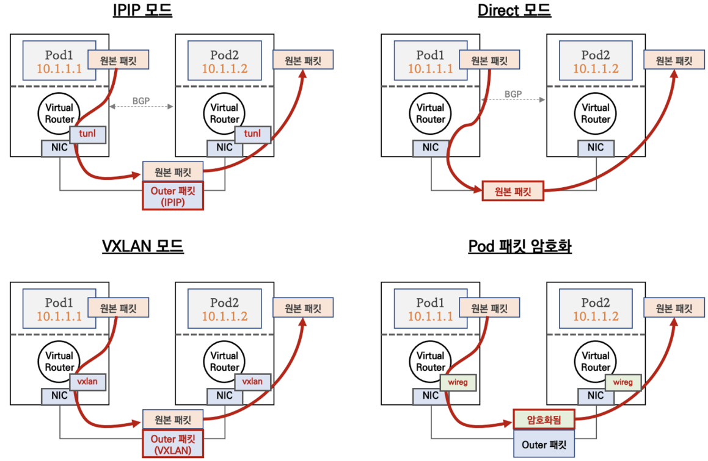

## Calico - Concept

<br>
<span style="color:rgb(85, 85, 85);">Calico 컨셉은 </span>**vRouter(가상 라우터)를 구현하고 BGP프로토콜을 이용하여 라우팅 정보를 공유**
<span style="color:rgb(85, 85, 85);">공유한 라우팅 정보를 이용하여 pod, service 네트워크 통신을 수행</span>
<span style="color:rgb(85, 85, 85);">외부 pod통신은 overlay 또는 Direct로 통신</span>
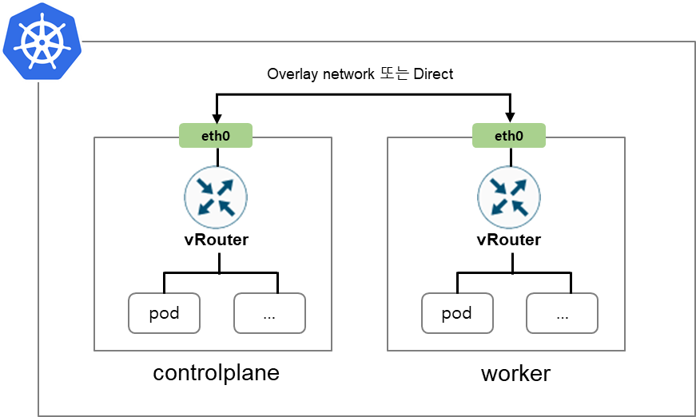

### Calico pod

<span style="color:rgb(85, 85, 85);">vRouter를 구축하기 위한 컴퍼넌트는 쿠버네티스 pod로 배포 됌.</span>
<span style="color:rgb(85, 85, 85);">controlplane노드에는 calico controller pod가 실행되고 각 노드마다 daemonset으로 calico node pod가 실행</span>
<span style="color:rgb(85, 85, 85);">calico에 대한 라우팅 정보 등을 datastore 컴퍼넌트에 저장되며 kubernetes / etcd 중 선택 (default: kubernetes)</span>
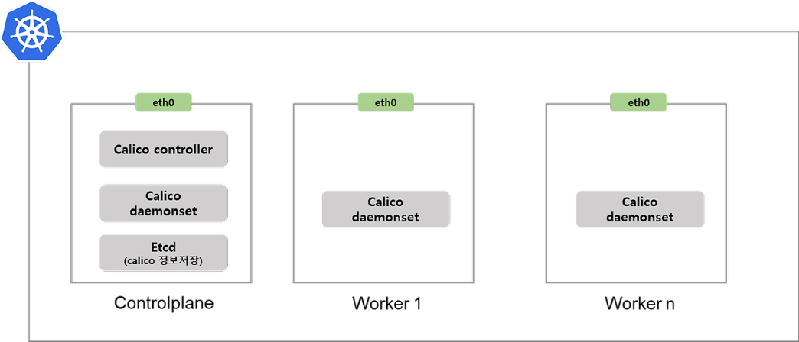

### IPAM

<span style="color:rgb(85, 85, 85);">calico에서 IP를 관리하기 위해 객체</span>
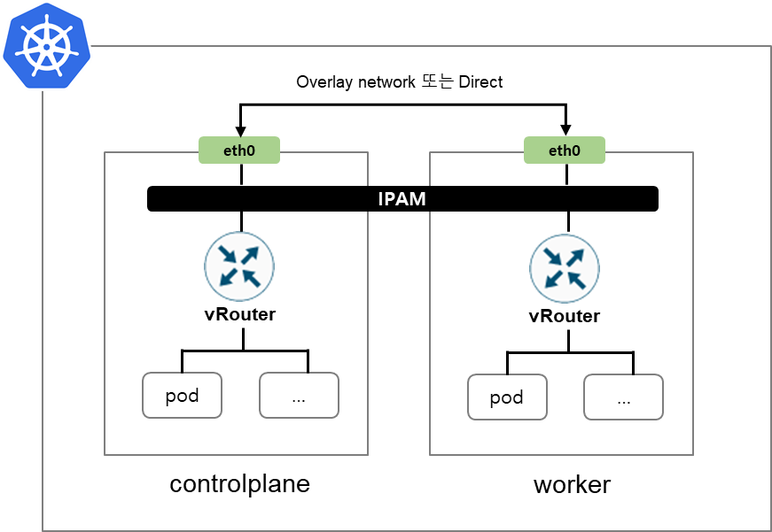

```
root@calico-demo-control-plane:/# calicoctl ipam show
+----------+----------------+-----------+------------+--------------+
| GROUPING |      CIDR      | IPS TOTAL | IPS IN USE |   IPS FREE   |
+----------+----------------+-----------+------------+--------------+
| IP Pool  | 192.168.0.0/16 |     65536 | 9 (0%)     | 65527 (100%) |
+----------+----------------+-----------+------------+--------------+
```

<br>
<span style="color:rgb(85, 85, 85);">각 노드는 IPAM 범위안에 속하는 pod cidr를 가지며, pod cidr는 IPAM block으로 관리</span>
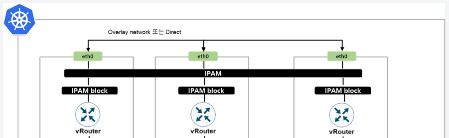

```
root@calico-demo-control-plane:/# calicoctl ipam show --show-blocks
+----------+-------------------+-----------+------------+--------------+
| GROUPING |       CIDR        | IPS TOTAL | IPS IN USE |   IPS FREE   |
+----------+-------------------+-----------+------------+--------------+
| IP Pool  | 192.168.0.0/16    |     65536 | 9 (0%)     | 65527 (100%) |
| Block    | 192.168.158.0/26  |        64 | 2 (3%)     | 62 (97%)     |
| Block    | 192.168.180.64/26 |        64 | 1 (2%)     | 63 (98%)     |
| Block    | 192.168.187.0/26  |        64 | 6 (9%)     | 58 (91%)     |
+----------+-------------------+-----------+------------+--------------+
```

### Felix

<span style="color:rgb(85, 85, 85);">felix컴퍼넌트는 라우팅 테이블과 iptables를 관리</span>
<span style="color:rgb(85, 85, 85);">라우팅테이블과 iptables는 같은 노드의 pod간 통신, ,다른 노드의 pod간 통신, pod와 외부 통신을 위한 설정 관리</span>
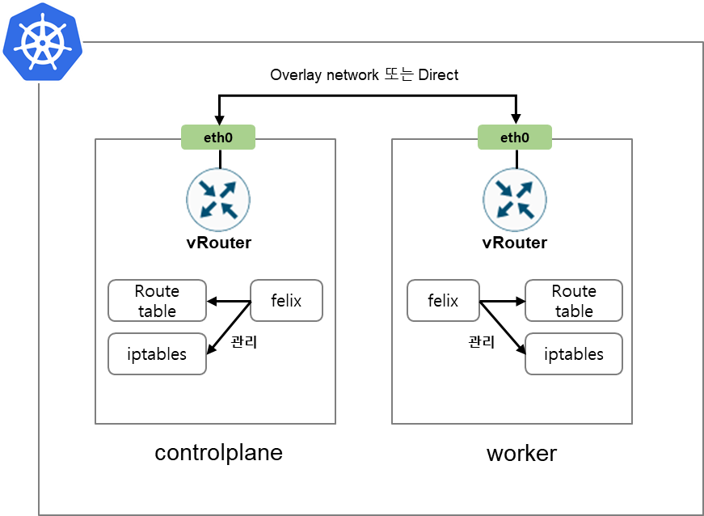
felix가 관리하는 iptables은 아래 명령어로 확인

```
root@calico-demo-control-plane:/# iptables -t filter -S | grep cali
-N cali-FORWARD
-N cali-INPUT
...
-A OUTPUT -m comment --comment "cali:tVnHkvAo15HuiPy0" -j cali-OUTPUT
-A cali-FORWARD -m comment --comment "cali:vjrMJCRpqwy5oRoX" -j MARK --set-xmark 0x0/0xe0000
-A cali-FORWARD -m comment --comment "cali:A_sPAO0mcxbT9mOV" -m mark --mark 0x0/0x10000 -j cali-from-hep-forward

root@calico-demo-control-plane:/# iptables -t nat -S | grep cali
-N cali-OUTPUT
-N cali-POSTROUTING
...
-A PREROUTING -m comment --comment "cali:6gwbT8clXdHdC1b1" -j cali-PREROUTING
```

### bird

<span style="color:rgb(85, 85, 85);">bird컴퍼넌트는 각 노드의 라우팅 정보를 공유 (BGP프로토콜)</span>
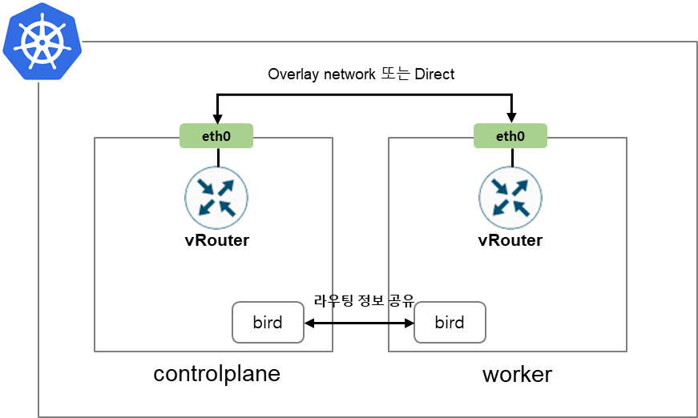
<span style="color:rgb(85, 85, 85);">Felix과 bird의 역할</span>
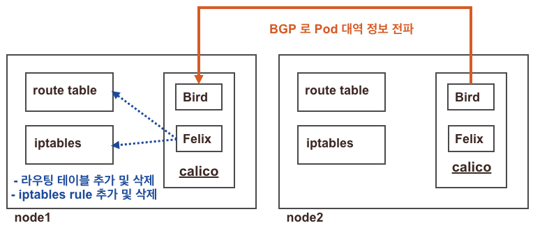

## Calico CNI - 설치 시 일어나는 일

### demo cluaster에 calico, calicoctl 설치 \& 구성 확인

```
kubectl apply -f https://raw.githubusercontent.com/projectcalico/calico/v3.28.0/manifests/calico.yaml
```

* calico 문서에서 제공해주는 yaml 파일로 별도의 설정없이 설치
* IPIP 모드로 overlay network 구축, bgp enable 설정 됌

```
curl -L https://github.com/projectcalico/calico/releases/download/v3.28.0/calicoctl-linux-amd64 -o calicoctl
chmod +x ./calicoctl
mv calicoctl /usr/local/bin/
```

데몬셋으로 각 노드에 calico-node 파드가 생성

* calico-node 파드에서 보이지 않은 많은 일을 한다.
    * 주된 업무: CNI Plugin 구성, 파드간 통신을 위한 네트워크 구축

```
# 노드 상태
kubectl get nodes
NAME                        STATUS   ROLES           AGE     VERSION
calico-demo-control-plane   Ready    control-plane   6m27s   v1.30.0
calico-demo-worker          Ready    <none>          6m6s    v1.30.0
calico-demo-worker2         Ready    <none>          6m6s    v1.30.0

# calico-node 파드 정보
kubectl get po -n kube-system | grep calico-node
calico-node-4j7lv                                   1/1     Running   0          4m48s
calico-node-5qcck                                   1/1     Running   0          4m48s
calico-node-zd6pq                                   1/1     Running   0          4m48s

# calicoctl node 정보 확인
calicoctl node status
IPv4 BGP status
+--------------+-------------------+-------+----------+-------------+
| PEER ADDRESS |     PEER TYPE     | STATE |  SINCE   |    INFO     |
+--------------+-------------------+-------+----------+-------------+
| 172.18.0.2   | node-to-node mesh | up    | 03:08:27 | Established |
| 172.18.0.3   | node-to-node mesh | up    | 03:08:27 | Established |
+--------------+-------------------+-------+----------+-------------+

# ippool 정보 확인
calicoctl get ippool -o wide
NAME                  CIDR             NAT    IPIPMODE   VXLANMODE   DISABLED   DISABLEBGPEXPORT   SELECTOR
default-ipv4-ippool   192.168.0.0/16   true   Always     Never       false      false              all()

# 파드와 서비스 새용 네트워크 대역 정보 확인 
kubectl cluster-info dump | grep -m 2 -E "cluster-cidr|service-cluster-ip-range"
                            "--service-cluster-ip-range=10.96.0.0/16",
                            "--cluster-cidr=192.168.0.0/16",

# 노드에서 컨테이너(프로세스) 확인 
ps axf
...
   4448 ?        Ss     0:00  \_ /usr/local/bin/runsvdir -P /etc/service/enabled
   4514 ?        Ss     0:00      \_ runsv cni
   4519 ?        S      0:00      |   \_ /bin/bash ./run
   4549 ?        S      0:00      |   |   \_ /bin/bash ./run
   4564 ?        S      0:00      |   |   |   \_ svlogd -ttt /var/log/calico/cni
   4550 ?        S      0:00      |   |   \_ /usr/bin/coreutils --coreutils-prog-shebang=tee /usr/bin/tee /dev/fd/63
   4523 ?        Sl     0:00      |   \_ calico-node -monitor-token
   4515 ?        Ss     0:00      \_ runsv felix
   4522 ?        S      0:00      |   \_ /bin/bash ./run
   4571 ?        S      0:00      |   |   \_ /bin/bash ./run
   4572 ?        S      0:00      |   |   |   \_ svlogd -ttt /var/log/calico/felix
   4573 ?        S      0:00      |   |   \_ /usr/bin/coreutils --coreutils-prog-shebang=tee /usr/bin/tee /dev/fd/63
   4527 ?        Sl     0:11      |   \_ calico-node -felix
   4516 ?        Ss     0:00      \_ runsv allocate-tunnel-addrs
   4520 ?        S      0:00      |   \_ /bin/bash ./run
   4561 ?        S      0:00      |   |   \_ /bin/bash ./run
   4562 ?        S      0:00      |   |   |   \_ svlogd -ttt /var/log/calico/allocate-tunnel-addrs
   4563 ?        S      0:00      |   |   \_ /usr/bin/coreutils --coreutils-prog-shebang=tee /usr/bin/tee /dev/fd/63
   4524 ?        Sl     0:00      |   \_ calico-node -allocate-tunnel-addrs
   4517 ?        Ss     0:00      \_ runsv node-status-reporter
   4525 ?        S      0:00      |   \_ /bin/bash ./run
   4566 ?        S      0:00      |   |   \_ /bin/bash ./run
   4570 ?        S      0:00      |   |   |   \_ svlogd -ttt /var/log/calico/node-status-reporter
   4567 ?        S      0:00      |   |   \_ /usr/bin/coreutils --coreutils-prog-shebang=tee /usr/bin/tee /dev/fd/63
   4528 ?        Sl     0:00      |   \_ calico-node -status-reporter
   4518 ?        Ss     0:00      \_ runsv monitor-addresses
   4521 ?        S      0:00          \_ svlogd /var/log/calico/monitor-addresses
   4526 ?        Sl     0:00          \_ calico-node -monitor-addresses
```

### CNI binary files 확인

```
/opt/cni/bin/
|-- bandwidth
|-- calico
|-- calico-ipam
|-- flannel
|-- host-local
|-- loopback
|-- portmap
|-- ptp
`-- tuning
```

### CNI configuration 확인

```
/etc/cni/net.d/
|-- 10-calico.conflist
`-- calico-kubeconfig
```

### Overlay Network 인터페이스 및 라우팅룰 확인

```
ip -c a s
1: lo: <LOOPBACK,UP,LOWER_UP> mtu 65536 qdisc noqueue state UNKNOWN group default qlen 1000
    link/loopback 00:00:00:00:00:00 brd 00:00:00:00:00:00
    inet 127.0.0.1/8 scope host lo
       valid_lft forever preferred_lft forever
    inet6 ::1/128 scope host
       valid_lft forever preferred_lft forever
2: tunl0@NONE: <NOARP,UP,LOWER_UP> mtu 1480 qdisc noqueue state UNKNOWN group default qlen 1000
    link/ipip 0.0.0.0 brd 0.0.0.0
    inet 192.168.180.64/32 scope global tunl0
       valid_lft forever preferred_lft forever
3: ip6tnl0@NONE: <NOARP> mtu 1452 qdisc noop state DOWN group default qlen 1000
    link/tunnel6 :: brd :: permaddr a218:7466:dcfa::

ip -c route
default via 172.18.0.1 dev eth0
172.18.0.0/16 dev eth0 proto kernel scope link src 172.18.0.4
192.168.158.0/26 via 172.18.0.3 dev tunl0 proto bird onlink
blackhole 192.168.180.64/26 proto bird
192.168.187.0/26 via 172.18.0.2 dev tunl0 proto bird onlink
```

### 설치 완료 후 구성 상태

* calico-node (비고: IPIP, bird enbled 했을 때의 프로세스 구성)
    * felix: `calico-node -felix`
    * confd: `calico-node -confd`
    * bird: `bird -R -s /var/run/calico/bird.ctl -d -c /etc/calico/confd/config/bird.cfg`

    <br>
* 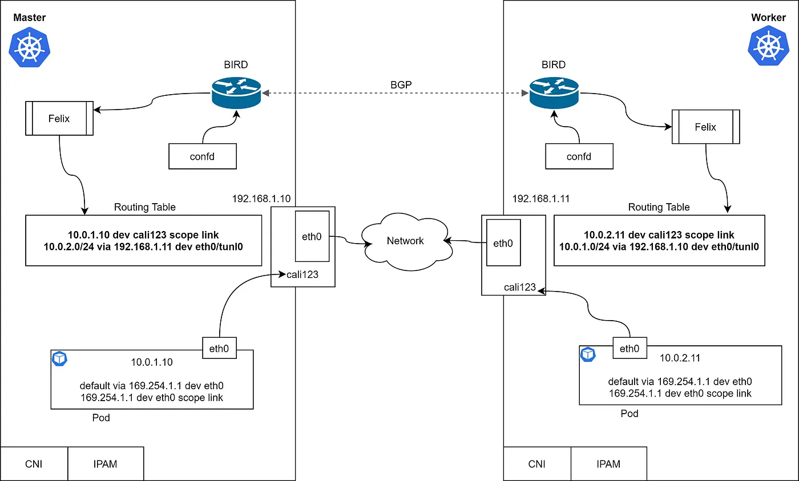
  <br>

# Calico CNI - POD 생성 시 일어나는 일

## POD 생성 및 확인

```
cat << EOF > pod-on-master.yaml
apiVersion: v1
kind: Pod
metadata:
  name: calico-pod-1
spec:
  nodeName: calico-demo-control-plane
  tolerations:
  - key: "node-role.kubernetes.io/control-plane"
    operator: "Exists"
    effect: "NoSchedule"
  containers:
    - name: calico-pod-1
      image: docker.io/library/netshoot
      command: ["tail"]
      args: ["-f", "/dev/null"]
EOF

# calico-worker 노드에 pod 생성
kubectl apply -f pod-on-master.yaml
```

## 생성 과정

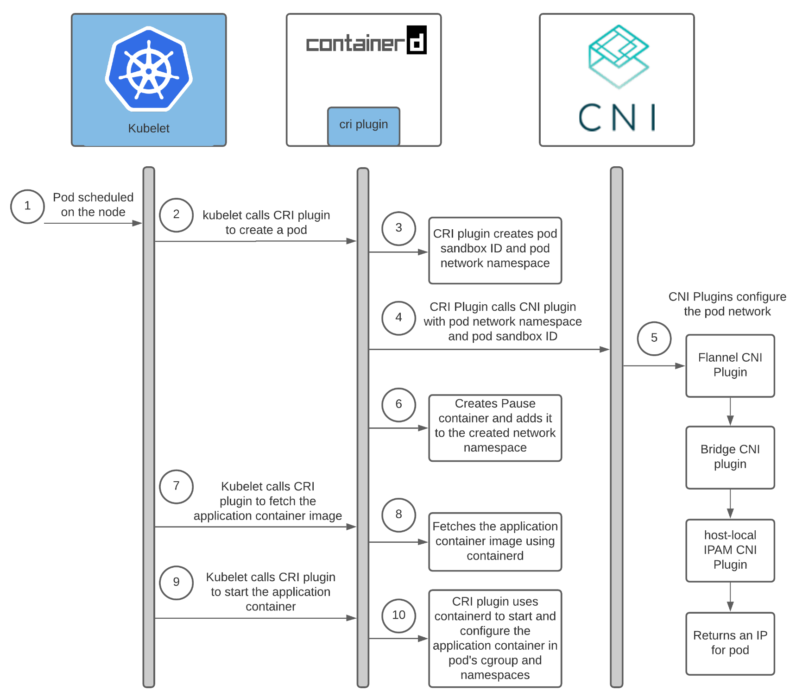

관련코드: [sandbox_run.go](https://github.com/containerd/containerd/blob/main/internal/cri/server/sandbox_run.go)

3. CRI plugin **creates** pod sandbox ID and **pod network namespace**
  * `sandbox.NetNS, err = netns.NewNetNS(netnsMountDir)`
4. CRI Plugin **calls CNI plugin with pod network namespace** and pod snadbox ID
  * `if err :- c.setupPodNetwork(ctx, &sandbox); err != nil {}`
5. CNI Plugins configure the pod network
  * `result, err = netplugin.Setup(ctx, id, path, opts...)
6. Creates Pause container and adds it to the created network namespace
  * `return &runtime.RunPodSandboxResponse{PodSandboxId: id}, nil`

호스트 네트워크를 사용하지 않고 사용자 네임스페이스도 활성화되지 않은 경우), 네트워크 네임스페이스를 설정하는 코드
containerd/internal/cri/server/sandbox\_run.go

```go
if !hostNetwork(config) && !userNsEnabled {
	...
	var netnsMountDir = "/var/run/netns"
	...
	sandbox.NetNS, err = netns.NewNetNS(netnsMountDir)
	...
	if err := c.setupPodNetwork(ctx, &sandbox); err != nil {  
	  return nil, fmt.Errorf("failed to setup network for sandbox %q: %w", id, err)  
	}
}
```

network namespace 경로:
`/var/run/netns/`

### 생성 완료 후 파드 정보 확인

#### 노드에서 정보 확인

```
# calicoctl - enpoint 정보 확인 
root@calico-demo-control-plane:/# calicoctl get workloadEndpoint
WORKLOAD       NODE                        NETWORKS            INTERFACE
calico-pod-1   calico-demo-control-plane   192.168.180.68/32   caliea14be05689

# interface 확인 
ip -c addr show | grep caliea14be05689 -A 1
9: caliea14be05689@if4: <BROADCAST,MULTICAST,UP,LOWER_UP> mtu 1480 qdisc noqueue state UP group default qlen 1000
    link/ether ee:ee:ee:ee:ee:ee brd ff:ff:ff:ff:ff:ff link-netns cni-f05cf44f-e050-8584-5d05-6ece134baf92

# 네트워크 네임스페이스 확인
ip netns
cni-f05cf44f-e050-8584-5d05-6ece134baf92 (id: 1)

lsns -t net
        NS TYPE NPROCS   PID USER     NETNSID NSFS                                                COMMAND
4026532706 net      41     1 root  unassigned                                                     /sbin/init
4026532878 net       2 11080 65535          1 /run/netns/cni-f05cf44f-e050-8584-5d05-6ece134baf92 /pause

# 라우팅 확인
ip route
default via 172.18.0.1 dev eth0
172.18.0.0/16 dev eth0 proto kernel scope link src 172.18.0.4
192.168.158.0/26 via 172.18.0.3 dev tunl0 proto bird onlink
blackhole 192.168.180.64/26 proto bird
192.168.180.68 dev caliea14be05689 scope link <<<<<<<<<<<<<<<<<<<<<<<<<<<<<
192.168.187.0/26 via 172.18.0.2 dev tunl0 proto bird onlink

# proxy arp 설정 확인
cat /proc/sys/net/ipv4/conf/caliea14be05689/proxy_arp
1
```

#### 파드 내에서 정보 확인

```
# interface
kubectl exec -it calico-pod-1 -- ip -c a s | grep eth0 -A 3
4: eth0@if9: <BROADCAST,MULTICAST,UP,LOWER_UP> mtu 1480 qdisc noqueue state UP group default qlen 1000
    link/ether 66:7e:1c:0b:79:60 brd ff:ff:ff:ff:ff:ff link-netnsid 0
    inet 192.168.180.68/32 scope global eth0
       valid_lft forever preferred_lft forever
    inet6 fe80::647e:1cff:fe0b:7960/64 scope link proto kernel_ll
       valid_lft forever preferred_lft forever

# ping
kubectl exec -it calico-pod-1 -- ping -c 1 192.168.187.2
PING 192.168.187.2 (192.168.187.2) 56(84) bytes of data.
64 bytes from 192.168.187.2: icmp_seq=1 ttl=62 time=0.420 ms

# arp
kubectl exec -it calico-pod-1 -- arp
? (169.254.1.1) at ee:ee:ee:ee:ee:ee [ether]  on eth0
? (192.168.180.64) at ee:ee:ee:ee:ee:ee [ether]  on eth0
```

# Calico CNI - POD 간 통신 과정

```
calicoctl get workloadEndpoint
WORKLOAD       NODE                  NETWORKS           INTERFACE
calico-pod-1   calico-demo-worker    192.168.187.5/32   caliea14be05689
calico-pod-2   calico-demo-worker2   192.168.158.1/32   cali8221c5dbdc9

kubectl get po -o wide
NAME           READY   STATUS    RESTARTS   AGE   IP              NODE                  NOMINATED NODE   READINESS GATES
calico-pod-1   1/1     Running   0          20m   192.168.187.5   calico-demo-worker    <none>           <none>
calico-pod-2   1/1     Running   0          22m   192.168.158.1   calico-demo-worker2   <none>           <none>

kubectl exec -it calico-pod-1 -- ping -c 2 192.168.158.1
```

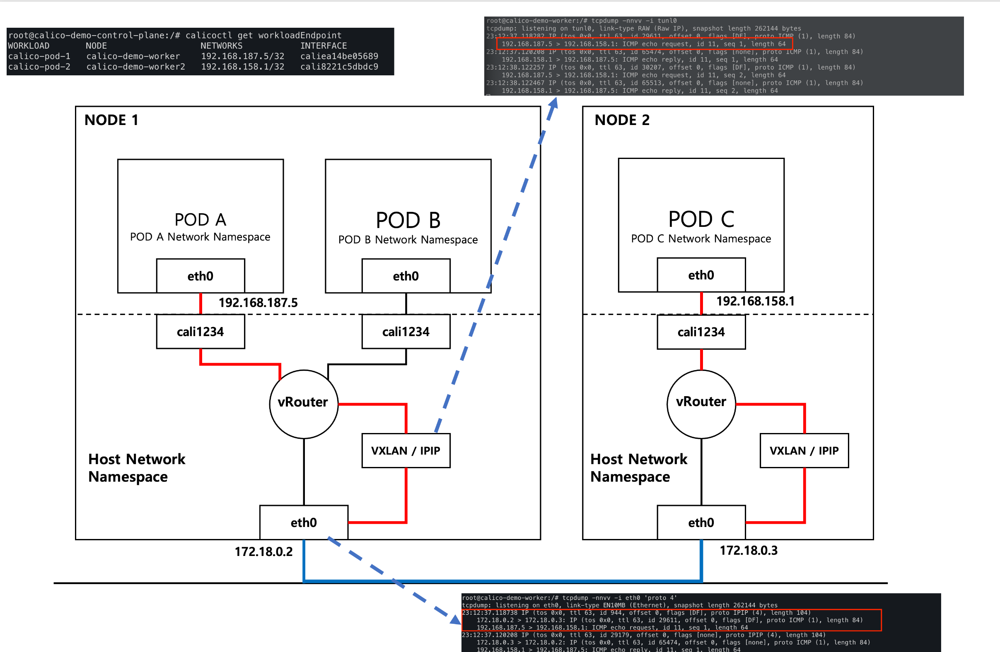

## 마무리하며..

Calico는 쿠버네티스의 파드간 통신을 구성하는 플러그인이다. 
Calico는 L3 라우팅 구성으로 파드간 통신을 구성한다. 
쿠버네티스 네트워크를 잘 이해하고, 운영하고, 활용하기 위해선 네트워크 전문가에 준하는 지식이 필요하다... 
일반적으론 깊게 이해하지 않아도 쿠버네티스 네트워크를 잘 동작한다. 
하지만 여러 조건 (아래 내용) 을 고려해야 할 땐 잘 모르면 잘 동작하지 않거나, 장애가 생긴다.

* 일반적 설치 구성이 아닌 (Kubeadm) 별도로 구성을 변경하여 설치하여 파드 네트워크 환경을 구성하려고하거나 <- NKS
    * 마스터 구성과 CNI 설정은 어떻게 하지?
* 일반적 이상의 성능 요구 및 분석 <- Shin...
    * 테스트 환경은 어떻게 구성??
    * 테스트 했을 때 성능이 안나오는 원인을 찾으려면..?
* 구성 변경 (VXLAN -> eBPF), pod 네트워크 대역 변경 <- NKS + Shin..
    * 장애 발생 시 어떤 구성에 문제가 있는거지?
        * calico 구성을 모르면 어떤 방식으로 통신이 구성되는지 알기 어렵고, 구성을 변경하기도 쉽지 않다 (예, IPIP -> VXLAN, ippool 변경 등)

CNI 정리하면서 느낀 개인견해: 
-> 컨테이너 개발 \& 운영에 네트워크 전문가가 필요하다....

<br>
## Ref.

[https://kubernetes.io/docs/concepts/cluster-administration/networking/](https://kubernetes.io/docs/concepts/cluster-administration/networking/)
[https://ronaknathani.com/blog/2020/08/how-a-kubernetes-pod-gets-an-ip-address/](https://ronaknathani.com/blog/2020/08/how-a-kubernetes-pod-gets-an-ip-address/)
[https://github.com/containerd/containerd/blob/main/internal/cri/server/sandbox_run.go](https://github.com/containerd/containerd/blob/main/internal/cri/server/sandbox_run.go)
[https://gasidaseo.notion.site/K8S-CNI-Calico-1-POD-b12040ffb62b45d98873cc42c3147dcb](https://gasidaseo.notion.site/K8S-CNI-Calico-1-POD-b12040ffb62b45d98873cc42c3147dcb)
[https://gasidaseo.notion.site/K8S-CNI-Calico-2-Node-1923e3ff0f9a43e598489cf3feb7e319](https://gasidaseo.notion.site/K8S-CNI-Calico-2-Node-1923e3ff0f9a43e598489cf3feb7e319)
[https://eddie.ee/186](https://eddie.ee/186)
[https://docs.aws.amazon.com/eks/latest/userguide/alternate-cni-plugins.html](https://docs.aws.amazon.com/eks/latest/userguide/alternate-cni-plugins.html)
[https://www.youtube.com/watch?v=WMLSD2y2Ig4](https://www.youtube.com/watch?v=WMLSD2y2Ig4)
[https://malwareanalysis.tistory.com/256](https://malwareanalysis.tistory.com/256)
[https://itnext.io/deciphering-the-kubernetes-networking-maze-navigating-load-balance-bgp-ipvs-and-beyond-7123ef428572](https://itnext.io/deciphering-the-kubernetes-networking-maze-navigating-load-balance-bgp-ipvs-and-beyond-7123ef428572)
[https://dramasamy.medium.com/life-of-a-packet-in-kubernetes-part-2-a07f5bf0ff14](https://dramasamy.medium.com/life-of-a-packet-in-kubernetes-part-2-a07f5bf0ff14)
[https://www.ibm.com/docs/en/cloud-private/3.1.2?topic=ins-calico](https://www.ibm.com/docs/en/cloud-private/3.1.2?topic=ins-calico)
[https://platformengineering.org/talks-library/secure-kubernetes-container-network-interface-cni-with-calico](https://platformengineering.org/talks-library/secure-kubernetes-container-network-interface-cni-with-calico)

<br>
